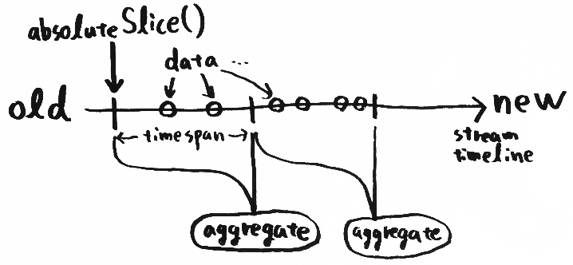
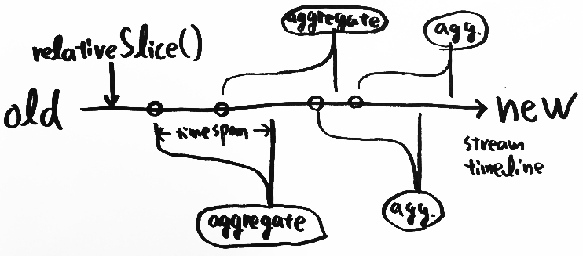

#sandglass[WIP]
Aggregates data stream timeline as time window.


#Usage

```javascript
var Sandglass = require( 'sandglass' );
var sandglass = new Sandglass();
```


#Sandglass

##emit( data );
Send data to all SandStreams.

##absoluteSlice( timespan );

Slices data stream timeline with timespan and aggregates each slice of data stream. Next aggregation starts after one aggregation ends, and another one starts again and again.



__Arguments__

1. timespan(Number): slice size (millisecond).

__Returns__

(sandStream): Fires `aggregate` event after stream aggregation.
`emitter.on( 'aggregate', callback );` 
`callback` gets an array of streaming data.

__Example__

```javascript
var sandStream = sandglass.absoluteSlice( 1000 );

setTimeout( function() { sandglass.emit( 1 ) }, 500 );
setTimeout( function() { sandglass.emit( 2 ) }, 800 );
setTimeout( function() { sandglass.emit( 3 ) }, 1700 );
setTimeout( function() { sandglass.emit( 4 ) }, 2100 );
setTimeout( function() { sandglass.emit( 5 ) }, 2300 );
setTimeout( function() { sandglass.emit( 6 ) }, 5000 );

sandStream.on( 'aggregate', function ( agg ) {
    console.log( '@agg:', agg );
    // => [ 1, 2, 3 ] (5 second later)
    // => [ 4, 5 ] (10 second later)
    // => [ 6 ] (15 second later)
    // => [] (20 second later)
    // ...
} );
```

##relativeSlice( timespan );

Slices data stream timeline with timespan and aggregates each slice of data stream. The aggregation starts at each incoming data, and it ends after it takes the timespan. 



__Arguments__

1. timespan(Number): slice size (millisecond).

__Returns__

(sandStream): Fires `aggregate` event after stream aggregation.
`emitter.on( 'aggregate', callback );` 
`callback` gets an array of streaming data.

__Example__

```javascript
var sandStream = sandglass.absoluteSlice( 1000 );

setTimeout( function() { sandglass.emit( 1 ) }, 500 );
setTimeout( function() { sandglass.emit( 2 ) }, 800 );
setTimeout( function() { sandglass.emit( 3 ) }, 1700 );
setTimeout( function() { sandglass.emit( 4 ) }, 2100 );
setTimeout( function() { sandglass.emit( 5 ) }, 2300 );
setTimeout( function() { sandglass.emit( 6 ) }, 5000 );

sandStream.on( 'aggregate', function ( agg ) {
    console.log( '@agg:', agg );
    // => [ 1, 2 ] ( 1.5 second later )
    // => [ 2, 3 ] ( 1.8 second later )
    // => [ 3, 4, 5 ] ( 2.7 second later )
    // => [ 4, 5 ] ( 3.1 second later )
    // => [ 5 ] ( 3.3 second later )
    // => [ 6 ] ( 6 second later )
} );
```


#SandStream

##on( event, listener );

Set event listener.
`sandStream.on( 'aggregate', function( agg ) {...} )`

##off( event, listener );

Remove event listener.

##stop();
Stop aggregation. GC works.

##other methods
see [EventEmitter2](https://github.com/asyncly/EventEmitter2)
