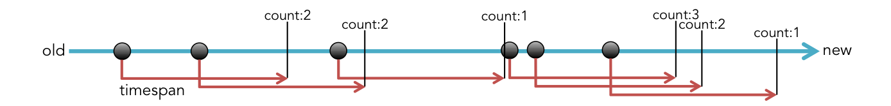
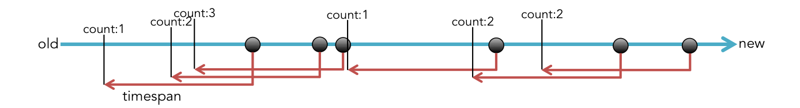
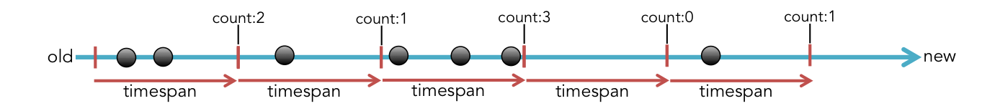

#sandglass
Time windowed event batching.


#Usage

```
var Sandglass = require( 'sandglass' );
var sandglass = new Sandglass();
```


#Sandglass Instance Methods

##emit( data );
バッチに掛けるデータを送信する。


##timeBatchForward( timespan );

このメソッドは新しいデータが到達した時点からtimespanだけ未来までの間に含まれるデータを返す。
実際には、データが到達した時点で集計を開始し、timespanだけ時間が経つと集計を終えてデータを返すので、timespanだけ遅延してデータが送られる。
When new data incoming, this method starts aggregation of data.
Aggregation completed over time that you specified in the `timespan`, and aggregated events will fire.

__Arguments__

1. timespan(Number): batch aggregation time (millisecond).

__Returns__

(sandglassEmitter): emitter fire `aggregate` events on complete batch aggregation. 
`emitter.on( 'aggregate', callback );` 
callback get array of object. 
Object has `timestamp` and `data` field.


##timeBatchBackward( timespan );

このメソッドは`timeBatchBackward`とは逆に、新しいデータが到達した時点からtimespanだけ過去までの間に含まれたデータを返す。
既にあるデータに対して集計を行うため、`timeBatchForward`の様に大きな遅延は発生しない。
When new data incoming, this method starts aggregation(picking).
Aggregation completed over time that you specified in the `timespan`, and aggregated events will fire.

__Arguments__

1. timespan(Number): batch aggregation time (millisecond).

__Returns__

(sandglassEmitter): emitter fire `aggregate` events on complete batch aggregation. 
`emitter.on( 'aggregate', callback );` 
callback get array of object. 
Object has `timestamp` and `data` field.


##slicingWindow( timespan );

このメソッドは時間軸を`timespan`の長さでスライスし、その間に含まれるデータを返す。
時間軸のスライスはこのメソッドが実行された瞬間から始まり、`timespan`毎にデータが返されると同時に新しい時間軸のスライスが始まる。

__Arguments__

1. timespan(Number): batch aggregation time (millisecond).

__Returns__

(sandglassEmitter): emitter fire `aggregate` events on complete batch aggregation. 
`emitter.on( 'aggregate', callback );` 
callback get array of object. 
Object has `timestamp` and `data` field.


#SandglassEmitter Instance method

##on( event, listener );
イベントハンドラの設置を行う。
`sandglassEmitter.on( 'aggregate', function( data[] ) {...} )`

__Arguments__

1. event(String): Event name of what you want. sandglassEmitter fires 'aggregation' event.
2. listener(Function): Event handler function. this get data array


##off( event, [listener] );
設置したイベントハンドラの削除を行う。

__Arguments__

1. event(String): Event name of what you want. sandglassEmitter fires 'aggregation' event.
2. listener(Function): Event handler function
